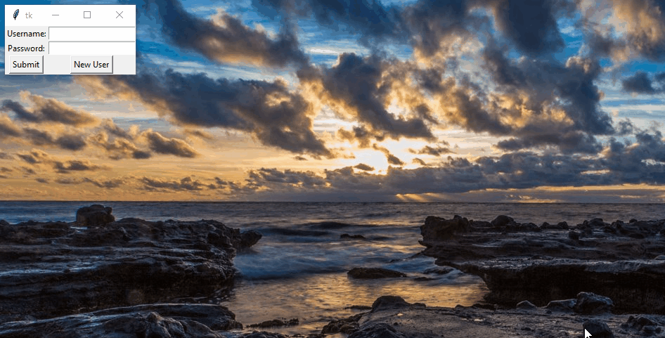
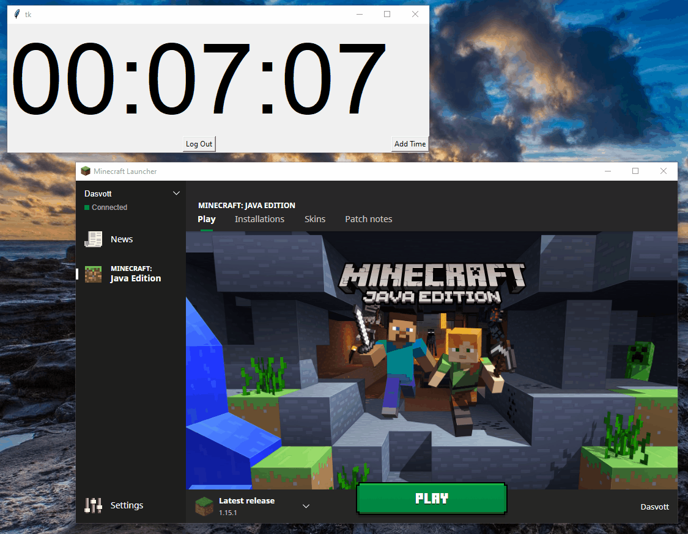
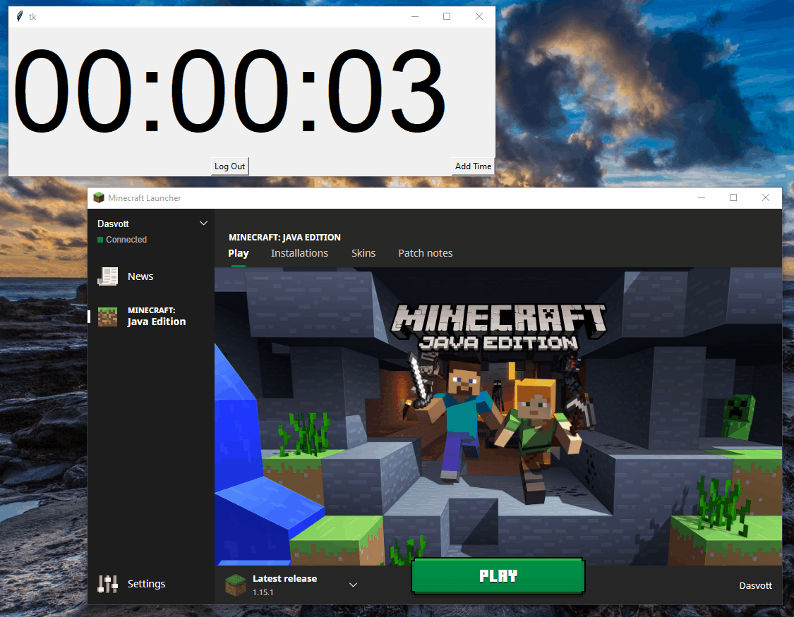

# ProcessPolice
Python program for regulating time spent playing video games.

## How It Works
The Process Police works by forcibly closing all open video games when you run out of play time. The program runs in the background
with a countdown timer. The timer only ticks when the program detects a running game. If you exit the game before the countdown 
reaches zero, the timer will freeze and you will be able to use the remaining time later; however, if you do not close your game 
before the countdown reaches zero, the program will kindly do it for you. Until you add more time, it will continue to forcibly close
any games you attempt to launch. You may add additional play time in the interface by studying, reading, or programming. 

<strong>FileHandler.py</strong>  
Handles all reading and writing of a user's data into .txt files. The files are encrypted to prevent manually editing the file
to add play time.  
<strong>ProcessHandler.py</strong>  
Checks for running video games and will forcibly close them if there is no remaining time.  
<strong>User.py</strong>  
Handles the addition and removal of each individual user's play time. Also maintains a log for future analysis.  
<strong>GUI3.py</strong>  
Handles all of the tkinter GUI.  

## Future Improvements<ul>
<li>Update text files data storage to a proper database</li>
<li>Expand to include blocking certain websites</li>
<li>Add more playtime for completing certain tasks (e.g. making your bed)</li>
<li>Utilize the log of user playtime to create interesting graphs and insight into each user's playing habits.</li>
</ul>

## Customization<ul>
<li>Currently blocks all games downloaded via Steam (scans the Steam directory), Minecraft, and League of Legends. If you would like
to block additional games, you will manually have to add the processes you wish to track.</li>
<li>You can tweak the ratio of playtime you receive in exchange for studying, reading, or programming. Currently you receive 50%
of the time spent on these activities in play time.</li>
</ul>

## Contact
If you have any questions about this project, please email me at dylkinder@gmail.com.

Enjoy!
